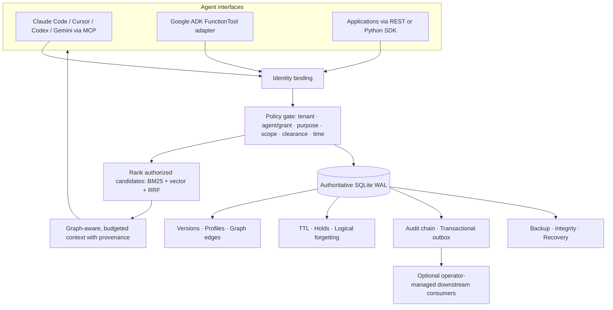

<div align="center">

# Google Agent Memory + Context Fabric
### Governed, persistent memory infrastructure for enterprise AI agents

**v3.0.0-rc1 · Python 3.11+ · SQLite local runtime · REST · MCP · Google ADK adapter**

**Remember with provenance. Retrieve with policy. Share with explicit grants. Forget deliberately.**

[Quick start](#quick-start) · [Architecture](#architecture) · [Security](#security-first) · [Agent integrations](#agent-integrations) · [Evaluation](#reproducible-evaluation) · [Operations](docs/OPERATIONS.md) · [Capability audit](docs/IMPLEMENTATION_AUDIT.md)

</div>

> **Release classification: enterprise-hardening *release candidate*, not an independently certified enterprise production system.** The local runtime, CLI, HTTP API and security/recovery paths have automated tests. HA, distributed stores, compliance certification, native end-to-end integrations and AgentMemory benchmark superiority are *not* claimed. This distinction is part of the project's reliability contract.

---

## Why a context fabric?

Most agent memory layers answer **“What should the agent remember?”** A production organization must also answer:

- **Who** is asking: which tenant, workload, agent, and authenticated identity?
- **Why** may it read the record: an approved purpose and classification?
- **When** is the fact relevant: validity interval, TTL, and source version?
- **Where** did the fact come from: source, evidence, revision and confidence?
- **Who else** may see it: narrowly scoped, expiring and revocable grants?
- **How** do we correct or erase it without retaining it in revision tables or graph links?
- **Can an operator** verify storage health, audit integrity, backup integrity and retrieval regression?

**Context Fabric** combines memory with a policy control plane. Every search first restricts candidates by tenant, ownership or grants, classification, purpose, scope and time; only then can they be ranked. Retrieved text is always marked **untrusted**, never authorization to execute tools.

### At a glance

| 🧠 Memory | 🔎 Retrieval | 🔐 Governance | ⚙️ Operations | 🔗 Interfaces |
|---|---|---|---|---|
| Six typed layers | BM25 lexical | Tenant and agent isolation | SQLite WAL + transactions | Python API |
| Provenance and revisions | Vector + RRF hybrid | Classification and purpose | Online backup / offline restore | Command-line `fabric` |
| Versioned typed profiles | Optional local embeddings | Scoped expiring grants | HMAC audit-chain verification¹ | Authenticated HTTP/OpenAPI |
| Explicit graph edges | ACL-checked graph hops | TTL, legal holds, forgetting | Health, readiness, metrics | MCP stdio + Google ADK example |
| Opt-in session events | Context token budgets | Optimistic concurrency | CI, evaluator, Docker | Browser memory explorer² |

¹ Requires `FABRIC_AUDIT_HMAC_KEY` before writing events and external retention of the head digest to detect truncation. ² Local development only; intentionally disabled in production mode.

### What this project does **not** claim

- It is **not** a multi-region PostgreSQL/Qdrant/Neo4j cluster. The authoritative backend is SQLite; distributed projection drivers in the historical architecture are **not implemented** in v3.
- It is **not** a substitute for a production IdP, TLS gateway, rate limiter, SIEM or backup key management.
- Hook capture is explicit opt-in and limited to approved prompt/summary fields, not 12+ transparent native hooks for every coding agent.
- Its default hash-vector representation is **not semantic understanding**. Learned embeddings require separately installed and configured models.
- The repository is **not proven better than** [rohitg00/agentmemory](https://github.com/rohitg00/agentmemory) on accuracy, automatic capture, adapter maturity or user adoption. See [comparison](#how-it-differs-from-agentmemory).

---

## Quick start

**Requirements:** Python 3.11+, pip, 100 MB free disk for the bare runtime. No paid LLM, cloud account or running vector database is needed for a local demonstration.

```bash
# From the extracted project directory
python3 -m venv .venv
source .venv/bin/activate       # Windows: .venv\Scripts\activate
python -m pip install -e '.[dev]'

fabric --db ./demo.sqlite demo
fabric-evaluate --k 3
python -m pytest -q
```

The demo writes two sample memories, retrieves one and scrubs both. It does not delete existing memories. Evaluation uses an included **12-document, 8-query synthetic** fixture. Neither result is a scientific benchmark of real developer sessions.

### Three commands to keep context across sessions

```bash
fabric --db ./demo.sqlite --agent coding-agent remember \
  'The billing service uses PostgreSQL and Alembic migrations' \
  --project billing --source ADR-014

# Start another terminal/session using the SAME database and agent identity:
fabric --db ./demo.sqlite --agent coding-agent recall \
  'How do billing migrations work?' --project billing

fabric --db ./demo.sqlite --agent coding-agent list
```

Use `fabric --help` to inspect the complete CLI. Default storage is `~/.context-fabric/memory.db`, and local CLI identities are **trusted process identities**, not remotely authenticated users. Never expose the CLI or its writable database file to untrusted processes.

### Start the authenticated HTTP server

```bash
python -m pip install -e '.[server]'
export FABRIC_API_KEY="$(python -c 'import secrets;print(secrets.token_urlsafe(36))')"
export FABRIC_DB="$PWD/demo.sqlite"
fabric serve --host 127.0.0.1 --port 8000 &
SERVER_PID=$!  # local demo only; stop with: kill "$SERVER_PID"
```

From this same shell (where `FABRIC_API_KEY` is set):

```bash
curl -s http://127.0.0.1:8000/health
curl -s http://127.0.0.1:8000/ready

curl -s -X POST http://127.0.0.1:8000/v1/memories \
  -H "x-api-key: $FABRIC_API_KEY" -H 'content-type: application/json' \
  -H 'idempotency-key: demo-architectural-decision-1' \
  -d '{"content":"Billing uses PostgreSQL and Redis","layer":"semantic","scope":{"project":"billing"},"source_id":"ADR-014"}'

curl -s -X POST http://127.0.0.1:8000/v1/search \
  -H "x-api-key: $FABRIC_API_KEY" -H 'content-type: application/json' \
  -d '{"query":"Where does billing persist invoices?","scope":{"project":"billing"},"retrieval_mode":"hybrid","limit":5,"token_budget":1000}'
```

Keep the key in the same shell in which you issue `curl`. `FABRIC_API_KEY` and `FABRIC_CREDENTIALS_JSON` are **development-only**; `FABRIC_MODE=production` rejects both at startup.

---

## Architecture



### Data flow and trust boundaries

1. **Authentication.** HTTP keys or verified OIDC claims map to immutable `Principal(tenant, agent, subject, clearance, roles)` values. Request JSON cannot choose or impersonate an identity.
2. **Write.** Validate memory, reject unauthorized classification/procedural approvals, then atomically persist current content, source/version, revision, audit and outbox event. Optional idempotency keys detect duplicate POSTs.
3. **Read.** Filter by tenant, time, purpose, project scope, classification, ownership or explicit grant **before ranking**.
4. **Rank.** Compute BM25 lexical rank and deterministic hash-vector or opt-in learned-embedding rank. Fuse valid hits via reciprocal-rank fusion (RRF). Optionally score graph-neighbors after rechecking access policy.
5. **Pack.** Respect requested item count and approximate token budget; attach source, confidence and an *untrusted content* warning.
6. **Correct / forget.** Use optimistic version comparison; forgetting blanks current and historical textual content, deletes graph links and idempotency mappings, and records audit metadata.

The database is **single-node** and in-process embeddings are computed on demand. Do not scale it with multiple API writers plus distributed workers without redesign and load testing. See [system design](docs/ARCHITECTURE.md).

### Six memory layers

| Layer | Typical data | Write policy |
|---|---|---|
| `working` | Current scratch context | Private to owner, cannot be granted |
| `session` | Session conclusions and handoff notes | Short TTL recommended; opt-in hooks write here |
| `episodic` | Incident timeline and outcomes | Source/validity metadata |
| `semantic` | Stable architecture decisions and facts | Confidence + revision history |
| `entity` | Service, person or system relationships | Scope + explicit graph edges |
| `procedural` | Reviewed runbooks and operational workflows | Requires `verified=true` **and** `procedure_approver` role |

A writer selects the layer; the package does **not** pretend to provide a magic LLM classifier. Integrators can build explicit, reviewable extraction pipelines using the Python API.

### A memory record looks like this

```json
{
  "content": "Billing uses PostgreSQL for authoritative writes",
  "layer": "semantic",
  "scope": {"project": "billing"},
  "classification": "INTERNAL",
  "confidence": 0.95,
  "source_type": "architecture-decision",
  "source_id": "ADR-014",
  "evidence": {"approved_by": "reviewer"},
  "purpose": "context",
  "ttl_days": 365,
  "verified": true
}
```

Writing generates a UUID, server-owned tenant/agent metadata, a content hash and a version. A search hit adds `score`, `provenance`, `untrusted: true`, and an injection-warning flag. **A search hit never has authority to invoke a tool.**

---

## Retrieval & evaluation

### Modes and what they mean

| Mode | Behavior | Good for |
|---|---|---|
| `lexical` | BM25 term scoring | Exact class names, error codes, ADR IDs |
| `vector` | Positive cosine vector ranking | Embedding-backed related concepts |
| `hybrid` | BM25 + vector with RRF | Balanced default |

The default vector uses deterministic **256-dimensional token hashes**, not deep-semantic embeddings. For genuine semantic search with local CPU/GPU inference:

```bash
pip install -e '.[semantic]'
export FABRIC_EMBEDDING_BACKEND=sentence-transformers
export FABRIC_EMBEDDING_MODEL=sentence-transformers/all-MiniLM-L6-v2
# Ensure the model is cached; to authorize the initial download explicitly:
export FABRIC_ALLOW_MODEL_DOWNLOAD=1
fabric recall 'How do users authenticate?'
```

Embedding availability, model licenses, RAM, data residency and changing score behavior are the operator's responsibility. For production, preload/pin a model and evaluate retrieval on your own data, preferably with an indexed vector store instead of this in-process scan.

`FABRIC_SEARCH_MAX_CANDIDATES` defaults to **5,000** per filtered query and is capped by configuration. If an exhaustive search would exceed that count, the runtime **returns a descriptive error instead of silently searching only the first 500 rows**. Filter by scope or implement a scalable indexed backend for larger deployments.

### Reproducible evaluation

```bash
fabric-evaluate --fixture benchmarks/fixtures/coding-agent-mini.json --mode hybrid --k 3
fabric-evaluate --fixture benchmarks/fixtures/coding-agent-mini.json --mode lexical --k 3
fabric-evaluate --fixture benchmarks/fixtures/coding-agent-mini.json --mode vector --k 3
```

The included fixture has **12 synthetic technical-memory documents / 8 questions**. On the validation environment, hybrid retrieval achieved `Recall@3 = 1.0` and `MRR@3 = 1.0`. These figures **do not generalize** to LongMemEval, LoCoMo, multilingual or long-context workloads. The evaluator reports fixture SHA-256, query-level ranked source IDs, p50/p95 local query latency and per-run retrieval mode. Details: [docs/BENCHMARKS.md](docs/BENCHMARKS.md).

**A fair AgentMemory comparison** requires the same dataset, relevant-document annotations, embedding budget, hardware, top-k, cold/warm cache and token limits. No winner is claimed without those experiments.

---

## Agent integrations

### MCP over stdio

```bash
pip install -e '.[mcp]'
fabric connect claude           # print editable client configuration
fabric connect cursor
fabric connect codex
fabric connect generic
fabric-mcp                     # waits for MCP stdio messages
```

Configure an **absolute** `FABRIC_DB` path and a trusted, distinct `FABRIC_AGENT` for each MCP client. MCP stdio inherits identity and filesystem permissions from the launching process: this is a **local trust boundary**, *not* an OIDC-authenticated remote multi-tenant MCP endpoint. Do not set `FABRIC_ROLES=admin` for untrusted MCP agents.

Supported MCP tool implementations include:

| Memory actions | Governance | Knowledge and reliability |
|---|---|---|
| `memory_remember` | `memory_grant` | `memory_neighbors` |
| `memory_recall` | `memory_revoke` | `memory_link` |
| `memory_list` | `memory_profile_get` | `memory_conflicts` |
| `memory_revise` | `memory_profile_set` | `memory_consolidation_candidates` |
| `memory_forget` | `memory_history` | `memory_integrity` (admin) |

These tools delegate authorization to the same core policy engine. Adapter package is optional and not included in the offline test environment; test against your actual client before production use.

Configs: [Claude](integrations/agents/claude-code.mcp.json) · [Cursor](integrations/agents/cursor.mcp.json) · [Codex](integrations/agents/codex.toml) · [Gemini](integrations/agents/gemini-cli.mcp.json) · [Google ADK](integrations/google_adk/README.md).

### Consent-based capture and safe session handoff

```bash
# Opt-in generic hook: accepts only 'prompt', 'user_prompt' or 'summary' fields
printf '{"prompt":"Use pytest for tests","session_id":"session-1"}' | \
  FABRIC_AUTO_CAPTURE=1 FABRIC_AGENT=claude-code \
  FABRIC_DB="$PWD/demo.sqlite" python -m context_fabric.hooks
```

The hook rejects obvious credentials, private keys, bearer tokens and suspected instruction-injection strings, ignores tool output, hashes source session IDs, caps input size and uses idempotency keys. Default TTL is seven days. **These are heuristic safeguards, not DLP certification**; disable the hook for regulated data without an approved data handling plan. `FABRIC_CAPTURE_DRY_RUN=1` validates the event without storing it.

---

## Security first

### Production identity: hashed service keys or OIDC

**The development plaintext key mode refuses to start when `FABRIC_MODE=production`.** Choose one of:

**Option A — salted, hashed service credentials**

```bash
fabric key-hash       # enter 32+ random-character service key, hidden input
```

Store only the generated verifier in a secret-managed configuration value named `FABRIC_HASHED_CREDENTIALS_JSON`. Example *shape* (substitute the full hash generated above):

```json
{
  "billing-worker": {
    "hash": "pbkdf2_sha256$310000$<hex-salt>$<hex-digest>",
    "principal": {
      "tenant": "team-billing",
      "agent": "billing-worker",
      "subject": "service-account:billing-worker",
      "clearance": "INTERNAL",
      "roles": []
    }
  }
}
```

All HTTP keys are compared against salted PBKDF2 verifiers. Credential rotation requires updating the configured verifier and restarting services; there is no online identity administration plane.

**Option B — OIDC JWTs validated via an operator-controlled HTTPS JWKS**

```bash
export FABRIC_MODE=production
export FABRIC_OIDC_ISSUER='https://idp.example.com/'
export FABRIC_OIDC_JWKS_URL='https://idp.example.com/.well-known/jwks.json'
export FABRIC_OIDC_AUDIENCE='context-fabric'
export FABRIC_OIDC_ALLOWED_TENANTS='team-billing,team-platform'
export FABRIC_OIDC_ALLOWED_ROLES='tenant_reader'
export FABRIC_OIDC_MAX_CLEARANCE='INTERNAL'
export FABRIC_AUDIT_HMAC_KEY="$(python -c 'import secrets;print(secrets.token_urlsafe(48))')"
fabric serve
```

An IdP-signed token must carry a `fabric` JSON claim object containing `tenant`, `agent`, optional `roles` and `clearance`, plus standard `sub`, `iss`, `aud`, `iat`, `exp`. The tenant **must** appear in the deployment allowlist. Requested roles are intersected with the configured allowable roles, and classification cannot exceed the configured ceiling. Only `RS256` / `ES256` are accepted; an attacker cannot supply arbitrary `jku` or JWKS URLs. This proves JWT signature/claims validation, **not** end-to-end SSO interoperability with every IdP. For bearer use, send `Authorization: Bearer <token>` (do not supply both types of credentials).

### Access model

| Check | Enforcement |
|---|---|
| Tenant | Hard partition in query and object access |
| Owner | Default private to owning agent |
| Other agent | Only explicit unexpired grant with scope/layer/purpose (except intentionally privileged `tenant_reader`) |
| Classification | `PUBLIC < INTERNAL < CONFIDENTIAL < RESTRICTED` |
| Purpose | Purpose equals requested purpose, unless role `all_purposes` is granted |
| Validity | `valid_from`, `valid_to`, `expires_at` |
| Procedures | Verified field plus dedicated approval role |
| Writes | Version conflict error prevents concurrent lost updates |
| Audit | Metadata events; optional HMAC chain and verifier |

**Threat-model highlights:** cross-tenant reads, grant revocation, role escalation, raw-memory instruction injection, sensitive-data capture, credential theft, snapshot recovery and denial of service. Secret scanning and prompt injection heuristics can have false negatives; do not regard remembered text as trusted instructions. See [docs/SECURITY.md](docs/SECURITY.md).

---

## Memory lifecycle and governance

### Sharing and revocation

```bash
fabric --db ./demo.sqlite --agent coding-agent grant reviewer --project billing --layer semantic
fabric --db ./demo.sqlite --agent reviewer recall 'billing storage' --project billing
# Owner can revoke using grant_id from grant output:
fabric --db ./demo.sqlite --agent coding-agent revoke GRANT_UUID
```

Only the owner (or designated admin) can revoke. Working memory is never grant-shareable. Permissions are enforced on every read—revocation does not depend on a stale search index refresh.

### Revisions and forgetting

```bash
fabric --db ./demo.sqlite --agent coding-agent revise MEMORY_UUID \
  'Billing now uses PostgreSQL 17' --version 1
fabric --db ./demo.sqlite --agent coding-agent forget MEMORY_UUID
```

Current and revision-table content are scrubbed and graph edges removed. **Deletion is logical, not a forensic sanitization guarantee**: WAL segments, file-system snapshots, backups and external projections can still hold old bytes. Coordinate backup expiry, checkpointing, downstream deletions and encryption-key lifecycle; legal holds intentionally block forgetting.

### Audit verification

```bash
# Configure a 32+-byte key BEFORE first event; retain and rotate through your secret manager.
export FABRIC_AUDIT_HMAC_KEY='replace-with-strong-unique-32-plus-character-secret'
fabric --db ./demo.sqlite --tenant local --roles admin audit-verify
```

Only newly created entries are HMAC-chained. Previously written entries remain **unsealed**, and verification correctly reports them as such. External anchoring of the final HMAC is needed to detect audit-log truncation by a database administrator.

---

## Enterprise pilot operations

The repository includes a hardened single-node Compose example, runbook and tests. **Do not directly expose the HTTP listener to the public internet.** Put it behind TLS, ingress authentication, WAF/rate-limiting, IP restrictions, centralized logs and a confidential secret store.

```bash
cp .env.production.example .env.production
chmod 600 .env.production
# Configure hashed key(s) or OIDC, and a 32+-byte audit HMAC key.
docker compose --env-file .env.production -f deploy/compose.production.yml up --build -d
curl -s http://127.0.0.1:8000/ready
```

The Compose deployment binds **only to 127.0.0.1**, uses a non-root user, drops Linux capabilities, disables privilege escalation, provides a writable data volume with a read-only root filesystem, and sets one server worker (SQLite-backed). These are security controls, not an HA SLA.

### Verify, back up and recover

```bash
fabric --db /path/to/data/memory.sqlite verify
fabric --db /path/to/data/memory.sqlite backup /secure/offhost/snap-2026-10-09.sqlite

# In an isolated recovery environment, stop live services first:
fabric restore-to-new /secure/offhost/snap-2026-10-09.sqlite /recovered/new-memory.sqlite
fabric --db /recovered/new-memory.sqlite verify
```

`restore-to-new` **never overwrites** an existing DB or WAL files. Restore in an isolated environment and switch deployment to the new file only after a documented maintenance window. Test restore regularly; snapshots should be encrypted and access controlled. A copy of the DB may retain information logically forgotten after the backup date. See [operations runbook](docs/OPERATIONS.md).

### Key API routes

| Endpoint | Description |
|---|---|
| `GET /health`, `GET /ready` | Liveness and database readiness |
| `POST /v1/memories` | Write versioned, attributed memory; optional idempotency key |
| `GET /v1/memories`, `GET /v1/memories/{id}` | Policy-filtered reads |
| `PATCH /v1/memories/{id}` | Optimistic revision |
| `GET /v1/memories/{id}/history` | Owner-only revision trail |
| `POST /v1/memories/{id}/forget` | Governed forgetting |
| `POST /v1/search`, `POST /v1/context` | Ranked, scoped, budgeted recall |
| `POST /v1/grants`, `POST /v1/grants/{id}/revoke` | Controlled sharing |
| `POST /v1/graph/edges`, `GET /v1/graph/{id}/neighbors` | ACL-filtered relationships |
| `PUT /v1/profiles`, `GET /v1/profiles/{name}` | Typed agent profiles |
| `GET /v1/audit`, `GET /v1/audit/verify` | Admin-only audit metadata and verification |
| `GET /v1/outbox`, `POST /v1/maintenance/sweep` | Admin operations |
| `GET /metrics` | Authenticated, aggregate in-process request counts |

Pydantic schemas and interactive OpenAPI documentation are available at `/docs` in the local API. `/viewer` is local-development-only; it is disabled in production mode. Sensitive responses set `Cache-Control: no-store` and include a sanitized `X-Request-ID`. Client body size is checked when `Content-Length` is set; configure an ingress-level hard body limit to cover streaming/chunked requests.

---

## How it differs from AgentMemory

[AgentMemory by Rohit Ghumare](https://github.com/rohitg00/agentmemory) is an established developer-focused memory product with native coding-agent plugins, automatic hooks, a polished installer and published benchmarks. **Context Fabric aims at a different layer**: explicit multi-tenant policy, provenance, legal-hold and deletion semantics, reviewed procedures and recovery operations.

| Dimension | Context Fabric v3 RC (verified/limited) | AgentMemory (publicly documented focus) |
|---|---|---|
| Primary use case | Governed enterprise context control plane | Cross-session memory for developer agents |
| ACL before retrieval | Explicit tenant, agent, purpose, scope, classification and grant rules | Different memory-sharing and security approach |
| Governance | Version history, hold, TTL, forget, HMAC audit option | Memory lifecycle, confidence and graph capabilities |
| Turnkey agent UX | MCP config examples; some adapters unverified | Stronger native adapters and automatic capture |
| Embeddings | Hash fallback, optional local SentenceTransformers | Hybrid semantic and lexical options |
| Benchmarks | Tiny synthetic fixture and reproducible evaluator | Much broader published evaluation suite |
| Persistence | SQLite single-node, operator-managed backups | Local-first engine with its own service/runtime |
| Enterprise certification | Not independently audited | Must independently verify for chosen deployment |
| GitHub ecosystem | Emerging project | Established contributor community |

**Where Context Fabric is differentiated:** stricter memory authorization and provenance/lifecycle controls built into the current code. **Where AgentMemory is ahead:** user onboarding, native agent ecosystem, published retrieval evidence and community maturity. To support a real “better than AgentMemory” claim, run identical public benchmarks, third-party security tests, deployment load tests and user adoption studies. No invented results are published here.

---

## Verified quality and release gates

- **47 automated tests** passing locally in the v3 build (storage, access control, backup/restore, OIDC claim/signature validation with offline JWKS mocking, API boundaries, hook redaction, audit tampering, retrieval evaluation).
- The included **8-query** mini evaluation fixture returned `Recall@3=1.0` and `MRR@3=1.0` on the local smoke run, **not** a production benchmark.
- Python packaging, built wheel, CLI and distributable ZIP are included in the release workflow.
- CI configuration covers Python 3.11–3.13, tests, packaging, evaluation and dependency auditing. The existence of a CI workflow is **not** proof that GitHub Actions has run successfully on your fork.

### Before a production rollout

- [ ] Run end-to-end MCP and Google ADK tests in the deployed agent environments.
- [ ] Test OIDC with the actual enterprise IdP; exercise JWKS rotation, token revocation and outage behavior.
- [ ] Put the API behind TLS ingress and external rate-limiting; set network policy, timeouts and hard request-size caps.
- [ ] Encrypt storage/backups and implement retention/key rotation and recovery exercises.
- [ ] Benchmark private organizational data and LongMemEval/LoCoMo under identical hardware/configuration.
- [ ] Perform independent application penetration tests, security review and dependency/SBOM scanning.
- [ ] Implement an HA-capable authoritative backend before requiring multi-node SLAs.
- [ ] Register operators, incident response, alerting and on-call ownership.

Details: [Implementation audit](docs/IMPLEMENTATION_AUDIT.md) · [Operations](docs/OPERATIONS.md) · [Security](docs/SECURITY.md) · [Benchmark methodology](docs/BENCHMARKS.md).

---

## Project map

```text
src/context_fabric/
  core.py             Memory, policy, retrieval, revision, graph, lifecycle
  security.py         Hashed keys, OIDC/JWKS, fail-closed config
  api.py              Authenticated REST API + local viewer + diagnostics
  cli.py              CLI, integrity, backup, recovery, key hashing
  mcp_server.py       Stdio tools and governed memory access
  hooks.py            Opt-in bounded, filtered session-event ingestion
  embeddings.py       Deterministic hash or opt-in SentenceTransformers
  backup.py           Offline restore to a new database file
  evaluate.py         Reproducible Recall@K and MRR evaluation
  fixtures/           Bundled synthetic evaluation fixture
benchmarks/fixtures/  Editable evaluation corpus
integrations/        Agent configs and Google ADK FunctionTool adapter
tests/               47 automated regression tests
.github/workflows/    CI and dependency audit
legacy/              Preserved original source, docs and uploaded archive
```

Your **original attached repository source and README are preserved** under `legacy/` and `docs/ORIGINAL_README.md`—not silently replaced. This release uses the current `src/context_fabric/` runtime, with a new v3 security/operations layer.

## Contributing, attribution and project status

Contributions and bug reports are welcome; include a minimal reproduction, proposed security impact, relevant access-control tests and a benchmark if retrieval behavior changes. Start with [CONTRIBUTING.md](CONTRIBUTING.md), [SECURITY.md](SECURITY.md) and [CHANGELOG.md](CHANGELOG.md).

**Maintainer:** Suhas Aggarwal · [github.com/suhasagg](https://github.com/suhasagg) · Repository: [google-agent-memory-context-fabric](https://github.com/suhasagg/google-agent-memory-context-fabric).

**License status:** the uploaded original repository archive did not contain a project-level LICENSE file. No new licensing terms have been invented on your behalf. Choose and add a license (for example Apache-2.0 or MIT, after reviewing third-party dependencies) before presenting this as openly reusable source code.

**Release date:** 2026-10-09 · **Release stage:** `v3.0.0-rc1` · **Status:** hardening candidate, not compliance-certified.
