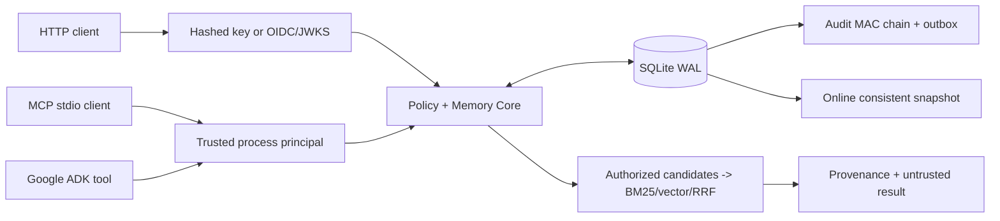

# Architecture and trust boundaries

## Authoritative data model

- `memories`: tenant-owned record, agent owner, scope JSON, layer, purpose, clearance class, content, source ID/type, evidence, confidence, revision version and time windows.
- `revisions`: append-on-revision provenance and content; scrubbed on forgetting.
- `grants`: from/to agent, layers, purposes, project scope, expiry and revoked bit.
- `edges`: typed links between memory records; reads are filtered using current access rules.
- `profiles`: typed versioned key/value records per tenant and agent.
- `audit`: action metadata and optional HMAC chain (`prev_mac`, `entry_mac`).
- `outbox`: committed events for future downstream consumers; no default cloud publisher.
- `idempotency`: request hash + key to prevent duplicate POST writes.

## Invariants

1. The HTTP body never sets tenant, agent or roles; only authenticated principals can.
2. Rankers only see records allowed by `_base_access`; grant revocation affects subsequent reads immediately.
3. Explicit procedures require verified content and approver role; remembered instructions are not tool authority.
4. SQL writes, audit and outbox are committed in a single transaction.
5. Revision updates require expected version; deletion scrubs revision content and removes graph edges.
6. No background retention worker is silently promised. Operators must schedule `fabric sweep` under an admin principal.

## Data and deployment constraints

SQLite is the authoritative database. It is durable for one host with correctly managed WAL/backups but not an HA multi-writer service. In-process BM25/vector scanning is bounded by `FABRIC_SEARCH_MAX_CANDIDATES`; more than that requires an indexed backend with transactional access-control joins and revocation tests.

For a clustered architecture, implement a PostgreSQL authoritative store, a tenant-partitioned embedding index, a graph projection consumer and a durable outbox dispatcher with leases/dead-letter handling; independently verify consistency and deletion propagation before any HA claim. The original [enterprise vision](ORIGINAL_README.md) is preserved as design reference, not running software.
